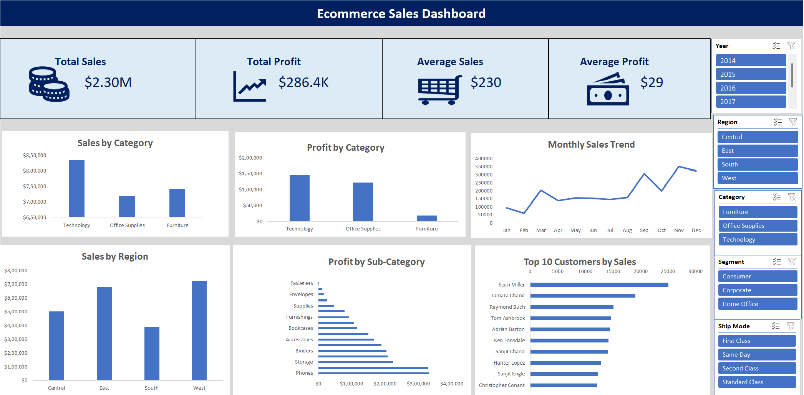
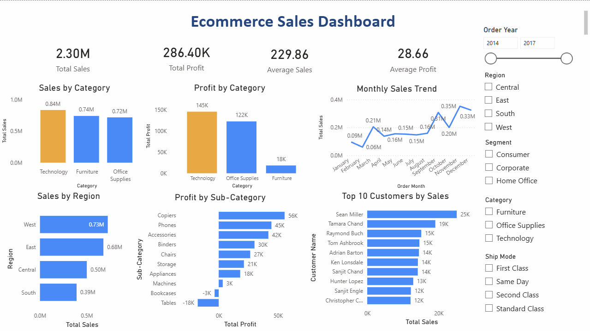

# 📊 Ecommerce Sales Dashboard

An end-to-end Data Analytics project that analyzes Superstore sales data using SQL, Python, Microsoft Excel, and Power BI.

The project demonstrates the complete analytics workflow—from raw data cleaning to interactive dashboards and business insights.

---


## 📌 Project Overview

This project was built to practice the complete Data Analytics lifecycle.

The workflow includes:

- Data Cleaning using Python
- Exploratory Data Analysis (EDA)
- SQL Business Analysis
- Interactive Excel Dashboard
- Interactive Power BI Dashboard
- Business Insights & Recommendations

---

## 🎯 Project Objective

The objective of this project is to transform raw Superstore sales data into meaningful business insights using Python, SQL, Microsoft Excel, and Power BI.

The project demonstrates the complete data analytics workflow, including data cleaning, exploratory analysis, business analysis, dashboard development, and data-driven recommendations.

---

## 🛠️ Tech Stack

- Python
- Pandas
- SQL (SQLite)
- Microsoft Excel
- Power BI
- Git
- GitHub
- Jupyter Notebook

---

## 📂 Project Structure

```
Ecommerce-Sales-Dashboard/
│
├── data/
│   ├── raw/
│   └── cleaned/
│
├── docs/
│   ├── Business_Problem.md
│   └── Business_Questions.md
│
├── excel/
│   └── Ecommerce Dashboard.xlsx
│
├── images/
│   ├── excel_dashboard_updated.png
│   └── powerbi_dashboard.png
│
├── notebooks/
│   ├── 01_Data_Understanding.ipynb
│   ├── 02_Data_Cleaning.ipynb
│   ├── 03_Exploratory_Data_Analysis.ipynb
│   ├── 04_SQL_Analysis.ipynb
│   ├── 05_Excel_Dashboard.ipynb
│   └── 06_PowerBI_Dashboard.ipynb
│
├── powerbi/
│   └── Ecommerce_Sales_Dashboard.pbix
│
├── sql/
│
├── README.md
├── requirements.txt
└── LICENSE
```

---

# 📈 Project Workflow

✔ Data Understanding

✔ Data Cleaning

✔ Exploratory Data Analysis

✔ SQL Analysis

✔ Excel Dashboard

✔ Power BI Dashboard 

---

# 📊 Excel Dashboard

The interactive Excel dashboard provides business users with an easy-to-understand overview of sales performance.

The dashboard combines KPI Cards, Pivot Tables, Pivot Charts, and Slicers to enable dynamic exploration of sales data.

### Files Included

- 📄 **Excel Dashboard Workbook** (`excel/Ecommerce Dashboard.xlsx`)
- 🖼️ **Dashboard Preview** (`images/excel_dashboard_updated.png`)

### Dashboard Preview



*Interactive Excel dashboard displaying KPIs, sales trends, category performance, regional analysis, and dynamic slicers.*

---

# 📊 Dashboard Features

The dashboard contains:

- KPI Cards
  - Total Sales
  - Total Profit
  - Average Sales
  - Average Profit

- Sales by Category

- Profit by Category

- Sales by Region

- Profit by Sub-Category

- Monthly Sales Trend

- Top 10 Customers

- Interactive Slicers
  - Year
  - Region
  - Category
  - Segment
  - Ship Mode

---

# 📊 Power BI Dashboard

The interactive Power BI dashboard provides a professional overview of ecommerce sales performance.

The dashboard uses DAX measures, interactive visualizations, and slicers to help users explore sales and profitability across different business dimensions.

### Files Included

- 📊 **Power BI Dashboard** (`powerbi/Ecommerce_Sales_Dashboard.pbix`)
- 🖼️ **Dashboard Preview** (`images/powerbi_dashboard.png`)

### Dashboard Preview



*Interactive Power BI dashboard displaying KPIs, category performance, regional sales, profitability by sub-category, monthly sales trends, top customers, and interactive slicers.*

---

# 📊 Power BI Dashboard Features

The dashboard contains:

- KPI Cards
  - Total Sales
  - Total Profit
  - Average Sales
  - Average Profit

- Sales by Category

- Profit by Category

- Sales by Region

- Profit by Sub-Category

- Monthly Sales Trend

- Top 10 Customers

- Interactive Slicers
  - Order Year
  - Region
  - Category
  - Segment
  - Ship Mode

---

 # ⭐ Repository Highlights

- ✔ End-to-End Data Analytics Project
- ✔ Data Cleaning using Python
- ✔ Exploratory Data Analysis (EDA)
- ✔ SQL Business Analysis
- ✔ Interactive Excel Dashboard
- ✔ Interactive Power BI Dashboard
- ✔ DAX Measures and KPI Analysis
- ✔ Business Insights & Recommendations
- ✔ Git Version Control
- ✔ Well-Documented Jupyter Notebooks

---

# 💡 Business Insights

- Technology generates the highest sales and profit.
- Copiers are the most profitable sub-category.
- The West region contributes the highest revenue.
- Sales fluctuate throughout the year, indicating seasonal demand.
- A small number of customers contribute a significant share of total sales.

---

# 📚 Notebooks

| Notebook | Description |
|----------|-------------|
| Notebook 01 | Data Understanding |
| Notebook 02 | Data Cleaning |
| Notebook 03 | Exploratory Data Analysis |
| Notebook 04 | SQL Business Analysis |
| Notebook 05 | Excel Dashboard |
| Notebook 06 | Power BI Dashboard |

---

# 🚀 Project Roadmap

- ✅ Python Data Cleaning
- ✅ Exploratory Data Analysis
- ✅ SQL Business Analysis
- ✅ Interactive Excel Dashboard
- ✅ Power BI Dashboard  
- 🔄 Customer Segmentation
- 🔄 Sales Forecasting
- 🔄 Time Series Analysis

---

## 👩‍💻 Author

**Divya Sesilia**

- GitHub: [divyasesilia](https://github.com/divyasesilia)
- LinkedIn: [Divya Sesilia](https://www.linkedin.com/in/divya-sesilia-204411349/)

---

⭐ If you found this project useful, consider giving it a star on GitHub.

Thank you for visiting this repository!
